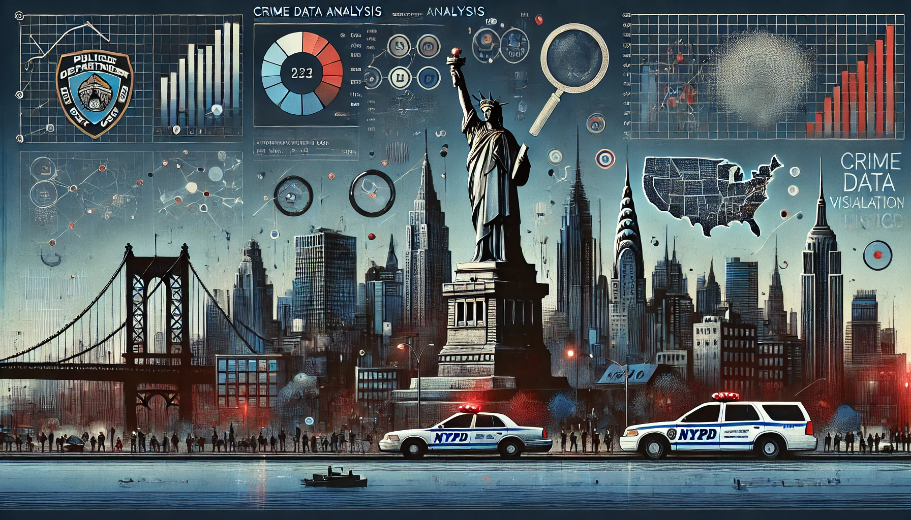

#

  

<h1 align="center">
  The Crime Data Analysis of NAPD.
</h1>

## 🧩 Introduction:

This project aims to explore and analyse crime patterns in Los Angeles using a dataset spanning from 2020 to the present. The primary focus is to extract meaningful insights by integrating structured data analysis and advanced techniques in SQL and Natural Language Processing (NLP). 🌦️ Weather data is merged with crime records to study the relationship between climatic conditions and criminal activities. SQL is utilised for efficient querying and pattern identification, while NLP is applied to crime descriptions to uncover trends, classify incidents, and perform sentiment analysis. This comprehensive analysis will help understand temporal, spatial, and contextual crime patterns, providing valuable insights into crime dynamics in the city. The project not only demonstrates technical expertise in SQL, MySQL, and Python but also showcases the ability to integrate AI-driven tools for actionable data insights, making it an impactful contribution to public safety research and career aspirations in the AI/ML domain. 🧠

#
## 🗄️  Data Set:

The dataset used in this project is publicly available and can be accessed from the following link:[ Crime Data from 2020 to Present](https://catalog.data.gov/dataset/crime-data-from-2020-to-present). This dataset includes detailed records of criminal incidents reported in Los Angeles from the year 2020 to the present (used dataset contains data till 18/12/2024). It contains various attributes such as the date and time of the incident, location, type of crime, and descriptions, which are crucial for conducting a thorough analysis of crime patterns and trends over time. 📊

#
## 🤔 Why Doing This Project:

This project is undertaken to deepen my understanding and proficiency in SQL, Large Language Models (LLM), Natural Language Processing (NLP), and Artificial Intelligence (AI). By working on real-world crime data, I aim to enhance my skills in data querying, pattern recognition, and sentiment analysis. The integration of weather data with crime records provides a unique opportunity to explore the intersection of environmental factors and criminal activities. 🌐 This hands-on experience will not only solidify my technical expertise but also demonstrate my ability to apply AI-driven tools to derive actionable insights, thereby contributing to public safety research and advancing my career in the AI/ML domain. 🚀

</d>
