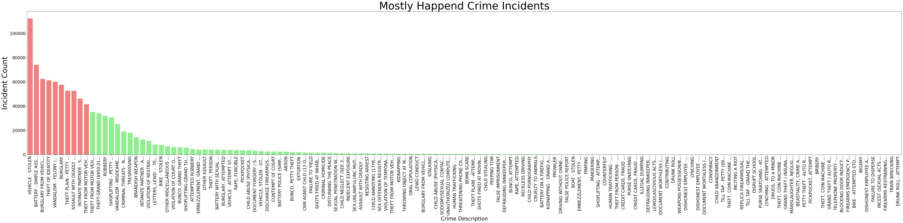

#
<p align="center">
  
</p>

<h1 align="center">
  The Crime Data Analysis of LAPD.
</h1>

## 🧩 Introduction:

<p align="Justify">
This project aims to explore and analyse crime patterns in Los Angeles using a dataset spanning from 
2020 to the present(2024/08/30). The primary focus is to extract meaningful insights by integrating structured data analysis and advanced techniques in SQL and Natural Language Processing (NLP). 🌦️ Weather data is merged with crime records to study the relationship between climatic conditions and criminal activities. SQL is utilised for efficient querying and pattern identification, while NLP is applied to crime descriptions to uncover trends, classify incidents, and perform sentiment analysis. This comprehensive analysis will help understand temporal, spatial, and contextual crime patterns, providing valuable insights into crime dynamics in the city. The project not only demonstrates technical expertise in SQL, MySQL, and Python but also showcases the ability to integrate AI-driven tools for actionable data insights, making it an impactful contribution to public safety research and career aspirations in the AI/ML domain. 🧠

#
## 🗄️  Data Set:
<p align="Justify">
The dataset used in this project is publicly available and can be accessed from the following link:  

[Crime Data from 2020 to Present](https://catalog.data.gov/dataset/crime-data-from-2020-to-present). 

<p align="center">
  
</p>
<p align="Justify">
This dataset includes detailed records of criminal incidents reported in Los Angeles from the year 2020 to the present (used dataset contains data till 18/12/2024). It contains various attributes such as the date and time of the incident, location, type of crime, and descriptions, which are crucial for conducting a thorough analysis of crime patterns and trends over time. 📊

### 📊 Refine Dataset:

To make the final dataset, I have added new columns containing,
- Year 
- Month 
- Date/Time 
- Temperature (°C) 
- Dew point (°C) 
- Humidity (%)  
- Precipitation (mm) 
- Wind Direction(degrees°) 
- Windspeed (km/h) 
- Air pressure (hPa) 
- Rainy Day or Not

The weather data was extracted based on the date and time using the 'meteostat' Python package.

<div align='center'>

| No  | Column                    | Non-Null Count         | Dtype   | Description                                           |
| --- | --------------------------| ---------------------- | ------- | ----------------------------------------------------- |
| 0   | DR_NO                      | 989329 non-null        | int64   | Unique report numbers                                 |
| 1   | Date Rptd                  | 989329 non-null        | object  | Date when crime was reported                          |
| 2   | DATE OCC                   | 989329 non-null        | object  | Date when crime occurred                              |
| 3   | TIME OCC                   | 989329 non-null        | object  | Time of occurrence (HHMM format)                      |
| 4   | AREA                       | 989329 non-null        | int64   | Numeric code for police area                          |
| 5   | AREA NAME                  | 989329 non-null        | object  | Name of the police area                               |
| 6   | Rpt Dist No                | 989329 non-null        | int64   | Reporting district number                             |
| 7   | Part 1-2                   | 989329 non-null        | int64   | Crime classification (1 = serious, 2 = less serious)  |
| 8   | Crm Cd                     | 989329 non-null        | int64   | Crime code                                            |
| 9   | Crm Cd Desc                | 989329 non-null        | object  | Description of the crime                              |
| 10  | Mocodes                    | 840950 non-null        | object  | Modus operandi codes                                  |
| 11  | Vict Age                   | 989329 non-null        | int64   | Age of victim (range: min to max)                     |
| 12  | Vict Sex                   | 989329 non-null        | float64 | Sex of victim (1=Male, 2=Female)                      |
| 13  | Vict Descent               | 847756 non-null        | object  | Victim's ethnic descent                               |
| 14  | Premis Cd                  | 989313 non-null        | float64 | Code for crime premises                               |
| 15  | Premis Desc                | 988761 non-null        | object  | Description of crime location                         |
| 16  | Weapon Used Cd             | 324301 non-null        | float64 | Code for weapon used                                  |
| 17  | Weapon Desc                | 324301 non-null        | object  | Description of weapon used                            |
| 18  | Status                     | 989328 non-null        | object  | Status of investigation (open/closed)                 |
| 19  | Status Desc                | 989329 non-null        | object  | Description of case status                            |
| 20  | Crm Cd 1                   | 989318 non-null        | float64 | Secondary crime code                                  |
| 21  | Crm Cd 2                   | 68823 non-null         | float64 | Tertiary crime code                                   |
| 22  | Crm Cd 3                   | 2312 non-null          | float64 | Additional crime code                                 |
| 23  | Crm Cd 4                   | 61 non-null            | float64 | Fourth crime code                                     |
| 24  | LOCATION                   | 989329 non-null        | object  | Crime location address                                |
| 25  | Cross Street               | 151168 non-null        | object  | Nearest cross street                                  |
| 26  | LAT                        | 989329 non-null        | float64 | Latitude of crime location                            |
| 27  | LON                        | 989329 non-null        | float64 | Longitude of crime location                           |
| 28  | Year                       | 989329 non-null        | int64   | Year of occurrence                                    |
| 29  | Month                      | 989329 non-null        | int64   | Month of occurrence                                   |
| 30  | Date/Time                  | 989329 non-null        | object  | Combined date and time of occurrence                  |
| 31  | Temperature (°C)           | 989329 non-null        | float64 | Temperature during crime (mean: X°C, min: Y°C)       |
| 32  | Dew point (°C)             | 989329 non-null        | float64 | Dew point during crime                                |
| 33  | Humidity (%)               | 989329 non-null        | float64 | Humidity level (%) at the time of the crime           |
| 34  | Precipitation (mm)         | 989329 non-null        | float64 | Rainfall in mm during crime                           |
| 35  | Wind Direction(degrees°)   | 989329 non-null        | float64 | Wind direction in degrees                             |
| 36  | Windspeed (km/h)           | 989329 non-null        | float64 | Wind speed in km/h                                    |
| 37  | Air pressure (hPa)         | 989329 non-null        | float64 | Air pressure during the incident                      |
| 38  | Rainy Day                  | 989329 non-null        | int64   | Indicator if it was a rainy day (1=Yes, 0=No)         |
</div>

#
## 🤔 Why Doing This Project:
<p align="Justify">
This project is undertaken to deepen my understanding and proficiency in SQL, Large Language Models (LLM), 
Natural Language Processing (NLP), and Artificial Intelligence (AI). By working on real-world crime data, 
I aim to enhance my skills in data querying, pattern recognition, and sentiment analysis. The integration 
of weather data with crime records provides a unique opportunity to explore the intersection of environmental
 factors and criminal activities. 🌐 This hands-on experience will not only solidify my technical expertise 
 but also demonstrate my ability to apply AI-driven tools to derive actionable insights, thereby contributing 
 to public safety research and advancing my career in the AI/ML domain. 🚀


<p align="center">
  
</p>

## 📈 Basic Analysis:

<p align="justify">
  In this section, we delve into the results of our data analysis, examining various 
  aspects of crime in Los Angeles. Through visualizations and statistical summaries,
  we explore temporal patterns, the impact of weather conditions on crime rates, and 
  the prevalence of different crime types. By analyzing the data, we aim to uncover 
  significant trends and insights that can inform public safety strategies and enhance 
  our understanding of crime dynamics in the city. The following subsections provide a 
  detailed look at the findings from our comprehensive analysis.
</p>

### 🕵️ All Types of Crimes Committed:

<p align="justify">
  Understanding the variety of crimes committed in Los Angeles is crucial for developing comprehensive crime prevention strategies. By categorizing and analyzing different types of crimes, we can identify which crimes are most prevalent and which are less common. This information helps law enforcement agencies prioritize their efforts and resources effectively. The following analysis provides a detailed overview of all types of crimes committed, highlighting both the most and least frequent crime types. This insight is essential for tailoring public safety measures and enhancing community awareness about crime trends in the city.
</p>

<p align="center">
  
</p>

#### 🔍 Mostly Happened Crime Types:

**MySQL Query:**
```
USE LAPD_Crime_Data;
SELECT 
     Crm_Cd_Desc AS Crime_Type,
     COUNT(*) AS CrimeCount
FROM 
  crime_data
GROUP BY Crime_type
HAVING CrimeCount >= "1000"
ORDER BY CrimeCount DESC
```


#### 🕵️ Least Happened Crime Types:

**MySQL Query:**
```
USE LAPD_Crime_Data;
SELECT 
     Crm_Cd_Desc AS Crime_Type,
     COUNT(*) AS CrimeCount
FROM 
  crime_data
GROUP BY Crime_type
HAVING CrimeCount < "1000"
ORDER BY CrimeCount DESC
```

<p align="center">
  
</p>


### ⏰ Crime vs Time:

<p align="justify">
  Analyzing crime data over different time periods reveals significant patterns that can
  help in understanding the temporal dynamics of criminal activities. By examining the
  distribution of crimes committed at various hours of the day, days of the week, and
  months of the year, we can identify peak times for criminal activities. This 
  information is crucial for law enforcement agencies to allocate resources more 
  effectively and implement targeted interventions. The analysis shows that certain 
  hours, particularly late at night and early morning, have higher crime rates, while 
  weekends tend to see a spike in incidents compared to weekdays. Understanding these
  temporal trends is essential for developing strategies to prevent and reduce crime 
  in Los Angeles.
</p>

#### ⏱️ Crimes Committed According to Hour:

Below is a graph depicting the distribution of crimes committed by the hour of the day. It clearly illustrates a distinct pattern, highlighting the differences in crime rates between daytime and nighttime. The analysis reveals that certain hours, particularly 5pm to 9pm time period, experience higher crime rates compared to other times of the day.

<p align="center">
  
</p>

#### 📅 Crimes Committed According to Day of the Week:

<p align="center">
  
</p>

### 🌡️ Crimes and Temperature:

<p align="center">
  
</p>

### 🔍 Mostly Happened Crime Types:

**MySQL Query:**
```
USE LAPD_Crime_Data;
SELECT 
     Crm_Cd_Desc AS Crime_Type,
     COUNT(*) AS CrimeCount
FROM 
	crime_data
GROUP BY Crime_type
HAVING CrimeCount >= "1000"
ORDER BY CrimeCount DESC

```

<p align="center">
  
</p>


<p align="center">
  
</p>

### 🕵️ Least Happened Crime Types:

**MySQL Query:**
```
USE LAPD_Crime_Data;
SELECT 
     Crm_Cd_Desc AS Crime_Type,
     COUNT(*) AS CrimeCount
FROM 
	crime_data
GROUP BY Crime_type
HAVING CrimeCount >= "1000"
ORDER BY CrimeCount DESC

```

<p align="center">
  
</p>

### 📍 Crimes and Locations:

<p align="center">
  
</p>

### 🗃️ Status of the Crimes: 
<div align="justify">
It looks like the majority of cases are still under investigation, which could be interesting
when you start analysing trends over time or by crime type! 

**MySQL Query:**

```
USE LAPD_Crime_Data;
SELECT 
     Status_Desc AS Current_Crime_Investigation_Type,
     COUNT(*) AS Crime_Type_Count
FROM 
	crime_data
GROUP BY Current_Crime_Investigation_Type
ORDER BY Crime_Type_Count DESC

```

- **Invest Cont (Investigation Continued) – 789,779 cases**
The investigation is still ongoing, and no final outcome has been determined yet. This is the most common status, indicating open cases.

- **Adult Other – 108,049 cases**
Cases involving adults that didn't result in an arrest but may have other outcomes like citations, warnings, or cases referred to other agencies.

- **Adult Arrest – 86,363 cases**
The suspect involved is an adult, and they were formally arrested.

- **Juv Arrest (Juvenile Arrest) – 3,293 cases**
A minor (under 18) was arrested.

- **Juv Other (Juvenile Other) – 1,838 cases**
Cases involving minors that didn’t lead to an arrest but could include warnings, diversions, or referrals to juvenile services.

- **UNK (Unknown) – 7 cases**
The status of these cases is unclear or not recorded.

</div>

#### Mostly Happened Crime in each Catagory:

Below Query will show most happend crime in each Catagory.

```
USE LAPD_Crime_Data;

WITH Ranked_Crimes AS (
    SELECT 
        Status_Desc AS Current_Crime_Investigation_Type,
        Crm_Cd_Desc AS Crime_Type_Description,
        COUNT(*) AS Crime_Count,
        ROW_NUMBER() OVER (
            PARTITION BY Status_Desc 
            ORDER BY COUNT(*) DESC
        ) AS Rank_Position
    FROM 
        crime_data
    GROUP BY 
        Status_Desc, 
        Crm_Cd_Desc
)

SELECT 
    Current_Crime_Investigation_Type,
    Crime_Type_Description,
    Crime_Count
FROM 
    Ranked_Crimes
WHERE 
    Rank_Position <= 30
ORDER BY 
    Current_Crime_Investigation_Type ASC, 
    Crime_Count DESC;

```

<p align="center">
  
</p>


---